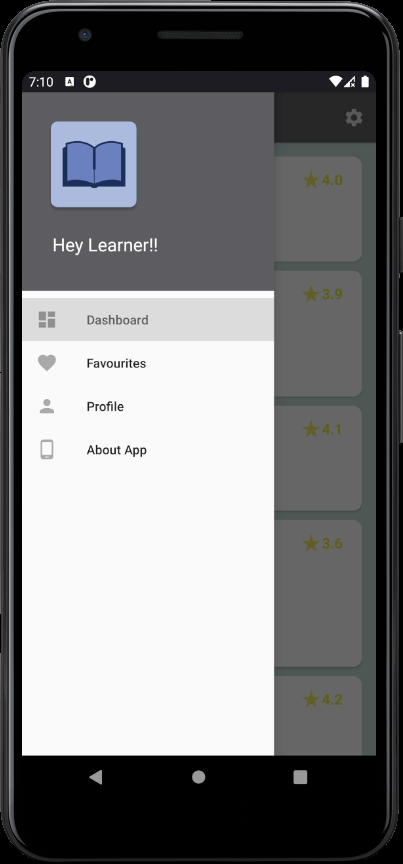
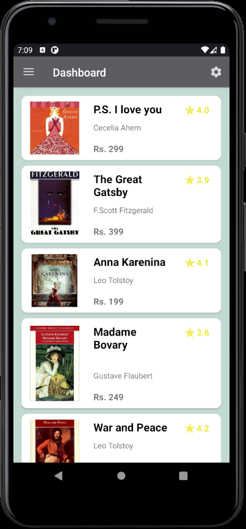
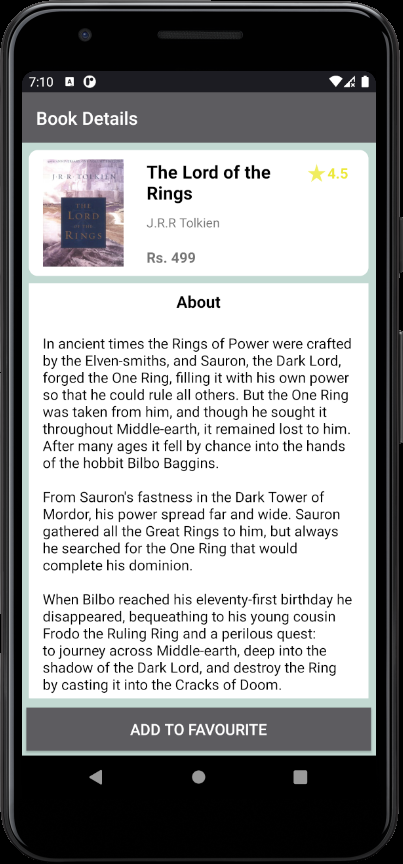
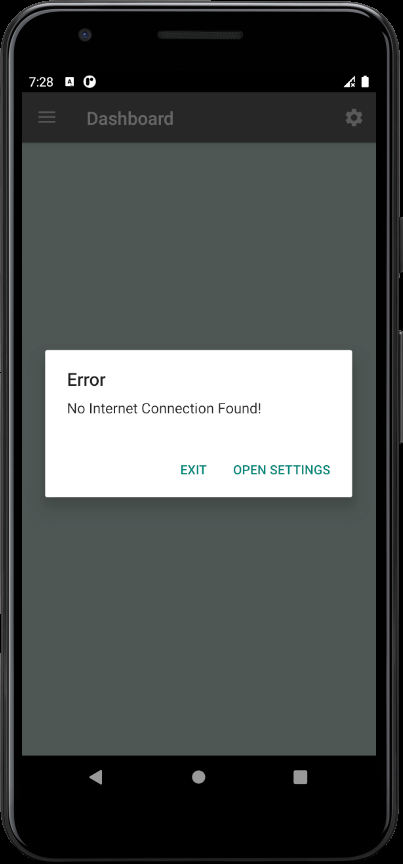

# BookApp-Android

This is a Demo of Book app which will fetch book data from a server.

External Libraries Used: 

Volley : for making GET and POST request. 
Picasso : for loading image into the ImageView.

### ***WORK IN PROGRESS***

Task TODO: 
&nbsp;&nbsp;&nbsp;&nbsp;&nbsp;&nbsp; 1. Favourite Book fragment.  
&nbsp;&nbsp;&nbsp;&nbsp;&nbsp;&nbsp; 2. Profile and About App fragment.   

### Screenshots

<table>
  <tr>
    <td>Navigation Drawer</td>
     <td>Dashboard Page</td>
     <td>Description Page</td>
  </tr>
  <tr>
    <td></td>
    <td></td>
    <td></td>
  </tr>
    <tr>
    </tr>
    <tr>
        <td>Error Dialog </td>
    </tr>
    <tr>
        <td></td>
    </tr>
 </table>
 

